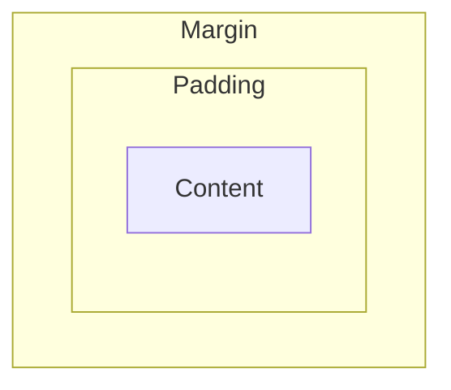

# CSS

## 盒模型

一个盒子拥有外部显示（盒子自己的行为）和内部显示（盒子内部元素的行为）两种类型

通过`display`属性设置

- inner
  - `block` 产生换行，未指定宽度时沿行向填充所有横向的外部空间
  - `inline` 不产生换行，且宽高被忽略，由左右内外边距和边框推开其他内容
- outer
  - `flex`
  - `grid`

e.g.

```css
.block {
    display: block;
}
```

没有指定内部显示类型时，内部元素以标准流的方式布局

一个完整的盒模型 be like:



Margin 和 Padding 的边界线是 Border

内容盒子（Content）的大小由 `inline-size` 和 `block-size` 或 `width` 和 `height` 等属性确定，是显示内容的区域

内边距盒子（Padding）的大小由 `padding` 和相关属性确定

边框盒子（Border）由 `border` 和相关属性确定

外边距盒子（Margin）的大小由 `margin` 和相关属性确定，是该盒子与别的元素间的空白

比如对于这样一个标准盒模型：

```css
.box {
    width: 350px;
    height: 150px;
    margin: 10px;
    padding: 25px;
    border: 5px solid black;
}
```

它实际占用的空间宽 (350 + 25 + 25 + 5 + 5) = 410px ，高 (150 + 25 + 25 + 5 + 5) = 210px

### 替代盒模型

设置属性 `box-sizing: border-box` 使此元素使用替代盒模型

此时此元素的宽度指的就是盒子的实际大小/页面上可见方框的宽度，比如对于上文提到的css设置，此元素占用的空间就为 350px * 350px

使用继承可以让所有元素都变成替代盒模型

```css
html {
    box-sizing: border-box;
}

*,
*::before,
*::after {
    box-sizing: inherit;
}
```

### 详细属性

比如 `margin` 属性还有 `margin-top` `margin-right` `margin-bottom` `margin-left` 这么些个用来更细粒度控制外边距的属性，它们可以为负数

`border` 属性也有，而且还有 `-width` `-style` `-color` 等控制样式的属性，且可以与细粒度属性结合产生最细粒度的普通属性

### inline-block

`display: inline-block` 是一个特殊值，介于 `inline` 和 `block`

它不会产生换行，但宽高值会起效，从而推开周边元素

## 层叠、优先级与继承

### 冲突规则

来自同一个源、具有相同的元素选择器、有相同的优先级的，*顺序在最后*的生效

比如：

```css
h1 {
    color: red;
}
h1 {
    color: blue;
}
```

`h1` 会被渲染成蓝色

### 继承

父元素的一些属性是可以被子元素继承的，但有些又不能

手动控制继承使用以下五个通用的特殊属性*值*

- `inherit` 使子元素属性和父元素相同
- `initial` 将属性值设置为该属性的初始值
- `revert` 将属性值重置为浏览器的默认样式
- `revert-layer` 将属性值重置为在上一个层叠层中建立的值
- `unset` 将属性重置为自然值

可以使用简写属性 `all` 配合上面的属性值，来快速改变所有属性的继承

## 优先级

优先级的优先级大于资源顺序

权重：

内联样式(`style=`) > ID(`#`) 选择器 > 类(`.`) 选择器 > 元素(`elementname`) 选择器

可以分别将它们当作千百十个位

参见：[选择器语法](https://developer.mozilla.org/zh-CN/docs/Web/CSS/CSS_selectors)

特殊属性值 `!important` 可以使属性定义覆盖所有普通规则（不推荐使用）

级联层 `@layer`，略去

## 基本文本和字体样式

### 颜色

使用css属性 `color` 设置前景色

### 字体

使用属性 `font-family` 属性指定字体

注意字体安全性，一般只有[网页核心字体](https://zh.wikipedia.org/zh-cn/%E7%B6%B2%E9%A0%81%E6%A0%B8%E5%BF%83%E5%AD%97%E5%9E%8B)能够直接使用

css定义的常用字体名称：

- <span style="font-family: serif;">serif</span> 衬线字体
- <span style="font-family: sans-serif;">sans-serif</span> 无衬线字体
- <span style="font-family: monospace;">monospace</span> 等宽字体
- <span style="font-family: cursive;">cursive</span> 手写字体
- <span style="font-family: fantasy;">fantasy</span> 装饰字体

`font-family` 属性是一个以逗号分隔的列表（字体栈），浏览器按顺序进行可用性检查，找到第一个可用的应用

一般会在最后提供一个通用字体名称

对于不止一个单词的字体名称，使用引号包裹，比如：

```css
p {
  font-family: "Trebuchet MS", Verdana, sans-serif;
}
```

#### 字体大小

使用 `font-size` 属性，会继承

常用的单位有：

- `px` 像素，绝对单位
- `em` 相对单位，1em等于父元素的字体大小
- `rem` 相对单位，1rem等于根元素的字体大小（root-em）

可以在根元素html中使用px，其余元素使用rem

#### 其他样式

可用属性：

- `font-style` - 打开/关闭斜体 `normal`/`italic`/`oblique`
- `font-weight` 字重 `normal`/`bold`/...
- `text-tansform` ...
- `text-decoration` ...
- `text-shadow` ...
- `text-align` ...
- `line-height` ...
- `letter-spacing` ...
- `word-spacing` ...
- ...

参见：<https://developer.mozilla.org/zh-CN/docs/Learn/CSS/Styling_text/Fundamentals#%E5%AD%97%E4%BD%93%E6%A0%B7%E5%BC%8F%E3%80%81%E5%AD%97%E4%BD%93%E7%B2%97%E7%BB%86%E3%80%81%E6%96%87%E6%9C%AC%E8%BD%AC%E6%8D%A2%E5%92%8C%E6%96%87%E6%9C%AC%E8%A3%85%E9%A5%B0>

## 布局

### 正常布局流

浏览器默认的布局方式

### Flexbox

将 `display: flex` 添加到父元素

参见 <https://developer.mozilla.org/zh-CN/docs/Learn/CSS/CSS_layout/Flexbox>

### Grid

将 `display: grid` 添加到父元素

参见 <https://developer.mozilla.org/zh-CN/docs/Learn/CSS/CSS_layout/Grids>

### Floats

设置元素的 `float` 属性

可能的属性值：

- `left`
- `right`
- `none`
- `inherit`

浮动的元素会向左/向右推开其他元素，浮动到一侧，y坐标不变

参见 <https://developer.mozilla.org/zh-CN/docs/Learn/CSS/CSS_layout/Floats>

### Positioning

一般用于管理微调特殊项

有五种主要的定位类型：

- 静态
- 相对
- 绝对
- 固定
- 粘性

参见 <https://developer.mozilla.org/zh-CN/docs/Learn/CSS/CSS_layout/Introduction#%E5%AE%9A%E4%BD%8D%E6%8A%80%E6%9C%AF>

### Tables

呃，一般更多用于显示表格数据

参见 <https://developer.mozilla.org/zh-CN/docs/Learn/CSS/CSS_layout/Introduction#%E8%A1%A8%E6%A0%BC%E5%B8%83%E5%B1%80>

### Columns

多列布局

使用 `column-count` `column-width` 属性做设置

参见 <https://developer.mozilla.org/zh-CN/docs/Learn/CSS/CSS_layout/Introduction#%E5%A4%9A%E5%88%97%E5%B8%83%E5%B1%80>
